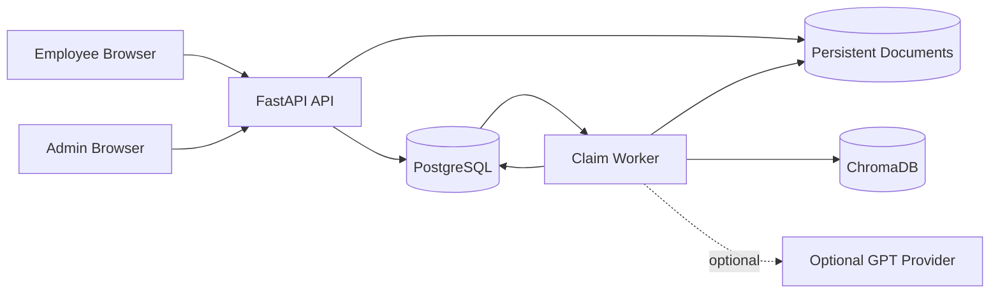
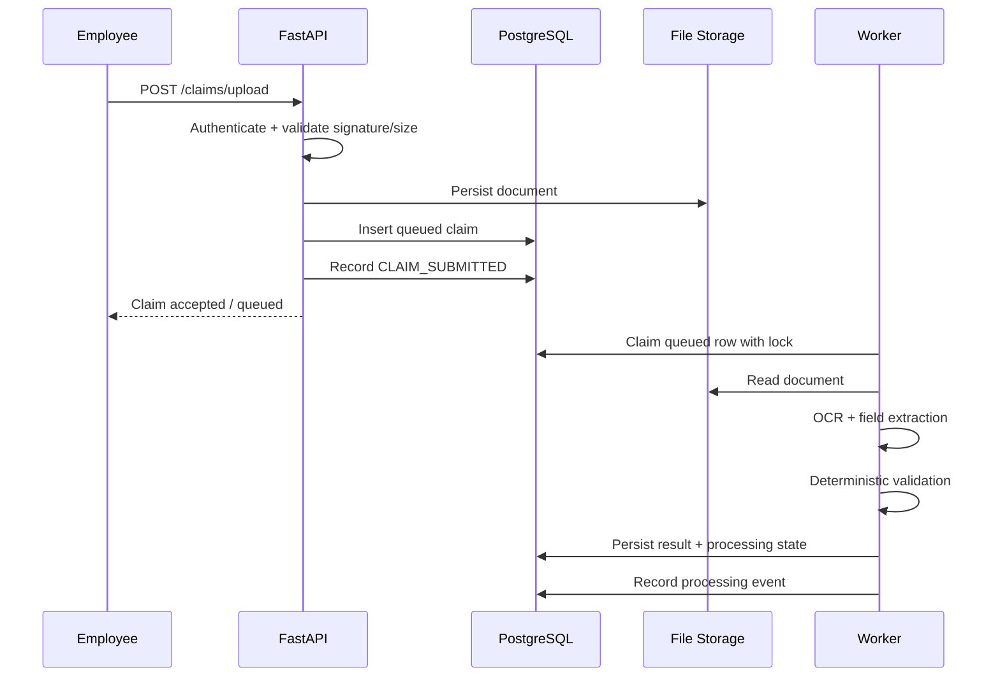
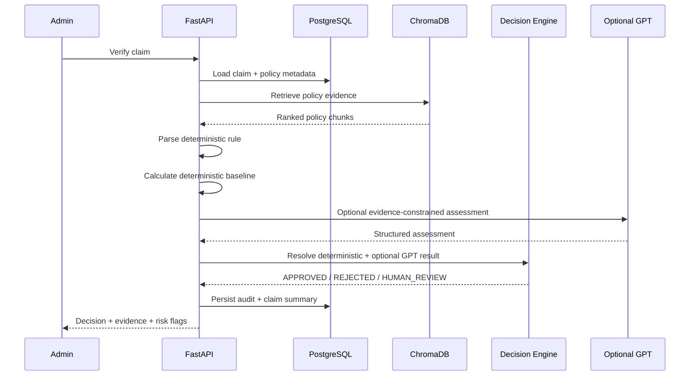
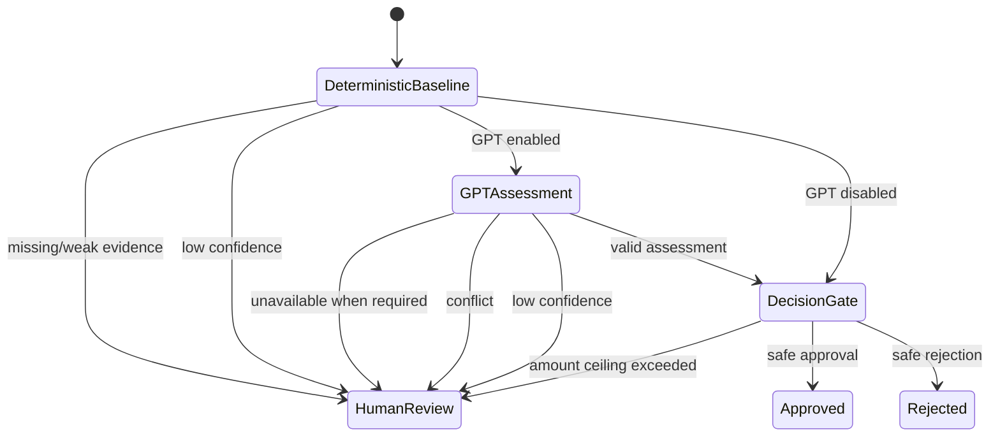
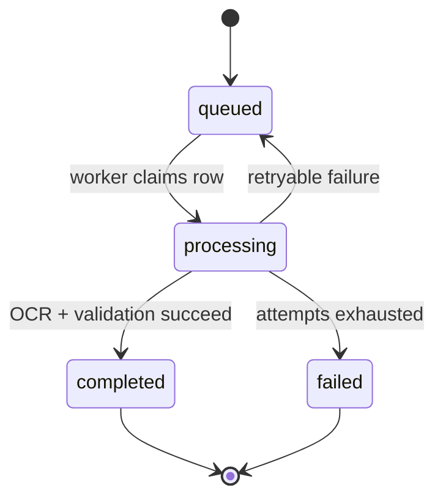
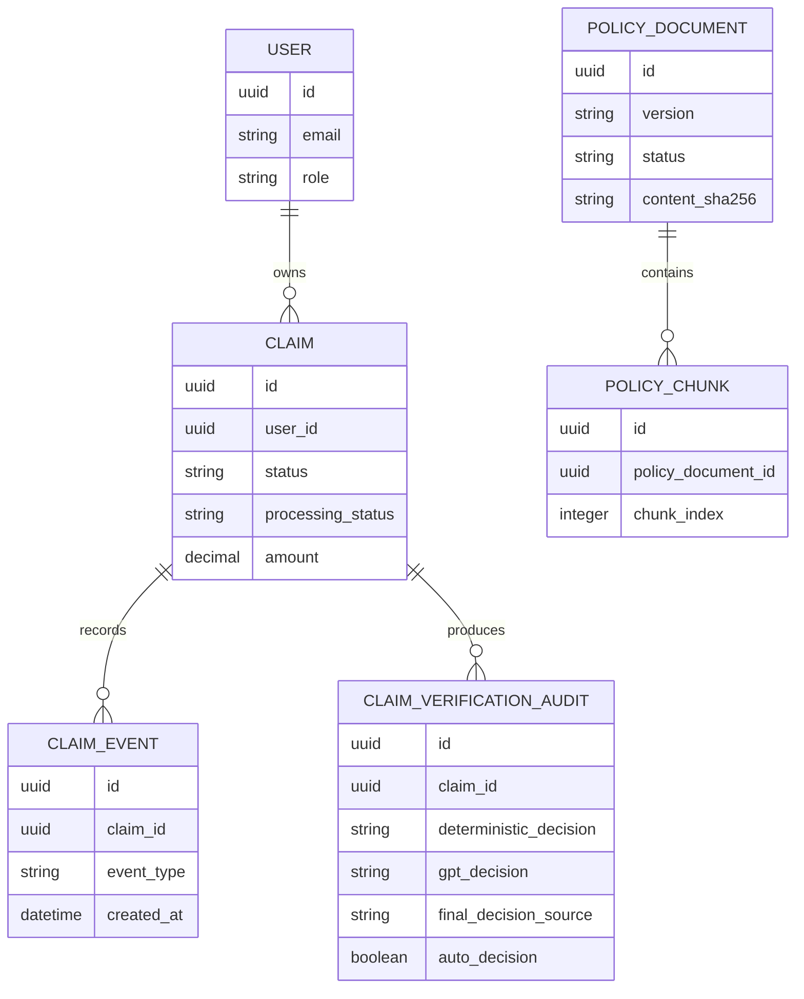
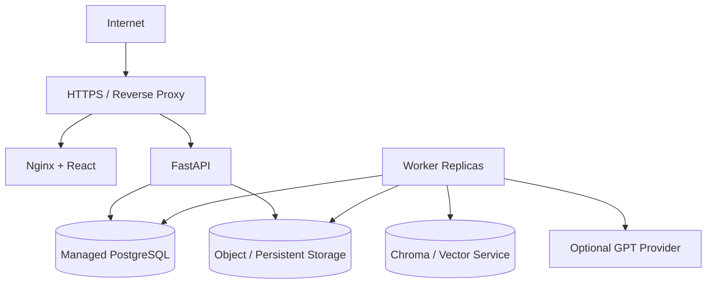
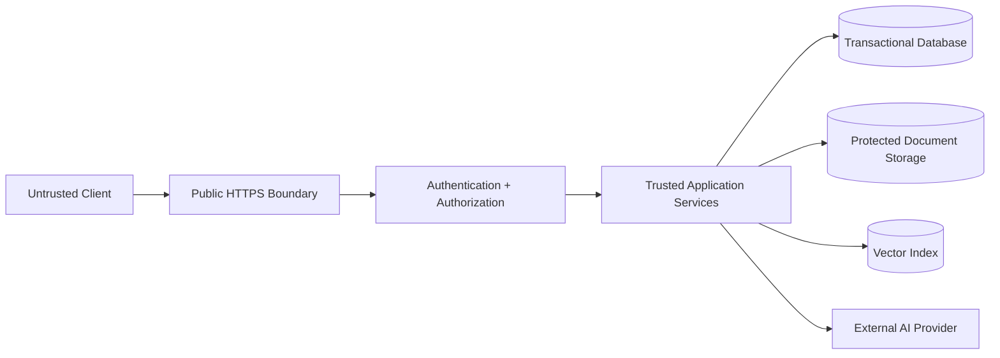

# Architecture Diagrams

These diagrams provide a visual model of the current implementation. Mermaid diagrams are intentionally kept in source so they can evolve with the repository.

## 1. System Context

## 2. Claim Submission Sequence

## 3. Policy Verification Sequence

## 4. Decision State Machine

## 5. Claim Processing State Machine

## 6. Data Relationships

## 7. Deployment Topology

## 8. Security Trust Boundaries

External AI and uploaded documents are treated as untrusted inputs. Deterministic business controls remain inside the trusted application boundary.
