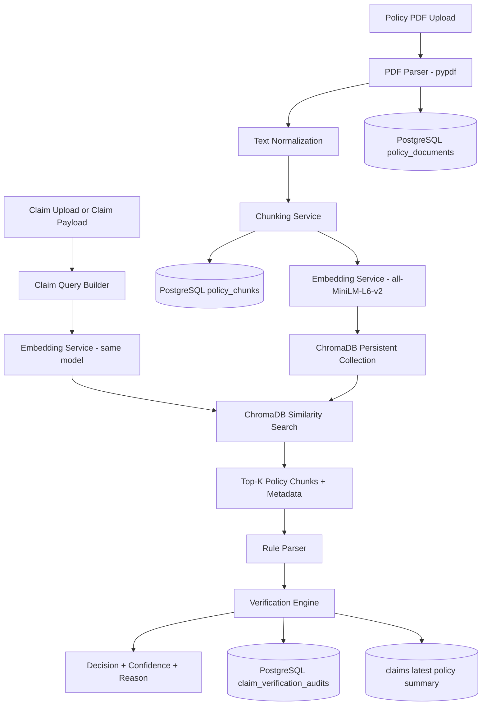

# Phase 2 RAG Architecture

## Goal

Phase 2 turns Medical Claim AI into a policy-aware verification platform for GAIL-style medical reimbursement policies. Policy PDFs are parsed, chunked, embedded with `sentence-transformers/all-MiniLM-L6-v2`, stored in ChromaDB, retrieved by semantic similarity, and used by a deterministic verification engine to produce explainable claim decisions.

Example decision:

```json
{
  "status": "Rejected",
  "approved_amount": 10000,
  "confidence": 0.96,
  "policy_used": "Dental treatment reimbursement is limited to Rs. 10,000 per year.",
  "policy_source": "Dental Reimbursement Policy | Dental v1.0 | dental-policy.pdf",
  "reason": "Claim exceeds maximum reimbursement limit"
}
```

## Architecture Diagram



## Enterprise Folder Structure

```text
backend/
  rag/
    api/
      dependencies.py
      routes.py
    config/
      logging.py
      settings.py
    db/
      models.py
    repositories/
      policy_repository.py
      vector_repository.py
      verification_repository.py
    schemas/
      policy.py
      verification.py
    services/
      chunking_service.py
      embedding_service.py
      ingestion_service.py
      pdf_parser.py
      retrieval_service.py
      rule_parser.py
      verification_service.py
    domain.py
    exceptions.py
  alembic/
    versions/
      0003_phase2_rag_policy_verification.py
  models.py
  schemas.py
  requirements.txt
docs/
  phase2_rag_architecture.md
```

## File-by-File Implementation

`backend/rag/config/settings.py`

Centralizes configuration for ChromaDB path, collection name, embedding model, chunk size, overlap, top-K retrieval, confidence floor, upload path, and logging path. These values are environment-driven so dev, test, and production can use different storage paths without code changes.

`backend/rag/config/logging.py`

Configures structured console and file logging for ingestion, retrieval, parsing, and verification. RAG failures are logged at the service boundary and returned through controlled FastAPI errors.

`backend/rag/db/models.py`

Defines:

- `PolicyDocument`: durable PDF metadata, raw extracted text, policy type, version, department, and status.
- `PolicyChunk`: PostgreSQL record of each indexed chunk, linked to the Chroma vector id.
- `ClaimVerificationAudit`: immutable verification trace, including claim payload, retrieved chunks, decision, reason, confidence, selected policy source, and optional `claim_id`.

`backend/models.py`

Extends the Phase 1 `Claim` model with `treatment` and latest policy summary fields: decision, approved amount, confidence, source, reason, and checked timestamp. Full explainability remains in the audit table.

`backend/rag/repositories/policy_repository.py`

Owns SQLAlchemy persistence for policy documents and chunks. The ingestion service uses this repository instead of writing directly to the database.

`backend/rag/repositories/vector_repository.py`

Owns ChromaDB integration. It creates a persistent collection using cosine distance, upserts policy chunks with metadata, deletes vectors during rollback, and converts Chroma distances into similarity scores.

`backend/rag/repositories/verification_repository.py`

Persists and lists verification audit records.

`backend/rag/services/pdf_parser.py`

Extracts text from policy PDFs with `pypdf`. It raises a domain error if no usable text is found, which prevents blank PDFs from entering the vector store.

`backend/rag/services/chunking_service.py`

Normalizes policy text and splits it into overlapping word chunks. Overlap protects against rules split across chunk boundaries.

`backend/rag/services/embedding_service.py`

Loads `sentence-transformers/all-MiniLM-L6-v2` once and generates normalized embeddings on CPU. The same service is used for ingestion and query embedding, keeping vector space consistent.

`backend/rag/services/ingestion_service.py`

Implements the ingestion pipeline:

```text
Policy PDF -> Text Extraction -> Chunking -> Embedding Generation -> PostgreSQL + ChromaDB
```

It commits SQL and vector writes together from the caller perspective, and performs best-effort Chroma cleanup if database persistence fails.

`backend/rag/services/retrieval_service.py`

Builds a semantic query from treatment, amount, employee, hospital, claim date, policy type, and department. It retrieves top-K ChromaDB chunks using metadata filters when available, then falls back to unfiltered search if no filtered hit exists.

`backend/rag/services/rule_parser.py`

Extracts deterministic reimbursement limits from retrieved clauses. It supports `Rs.`, `INR`, the rupee symbol, comma-formatted Indian amounts, lakh/lac, and crore units.

`backend/rag/services/verification_service.py`

Implements the explainable verification engine:

1. Retrieve relevant policy chunks.
2. Select the first safely parseable reimbursement rule.
3. Compare claim amount against policy limit.
4. Return `Approved`, `Rejected`, or `Needs Human Review`.
5. Persist audit details and, for stored claims, update the latest policy summary on `claims`.

`backend/rag/api/dependencies.py`

Provides FastAPI dependency injection for settings, embedding service, vector repository, repositories, and orchestration services. Long-lived expensive objects are cached.

`backend/rag/api/routes.py`

Exposes:

- `POST /rag/policies/ingest`
- `GET /rag/policies`
- `GET /rag/policies/{policy_document_id}`
- `POST /rag/claims/verify`
- `POST /rag/claims/{claim_id}/verify`
- `GET /rag/verifications`

`backend/alembic/versions/0003_phase2_rag_policy_verification.py`

Creates the Phase 2 database schema and adds the claim policy summary columns.

`backend/requirements.txt`

Includes the required RAG dependencies:

- `chromadb`
- `sentence-transformers`
- `pypdf`
- `pydantic-settings`

## Database Schema

### `claims`

Phase 1 fields plus:

- `treatment`
- `policy_decision`
- `policy_approved_amount`
- `policy_confidence`
- `policy_source`
- `policy_reason`
- `policy_checked_at`

### `policy_documents`

- `id`
- `title`
- `source_filename`
- `source_path`
- `policy_type`
- `policy_version`
- `department`
- `status`
- `raw_text`
- `metadata_json`
- `created_at`
- `updated_at`

### `policy_chunks`

- `id`
- `policy_document_id`
- `chunk_index`
- `chunk_text`
- `vector_id`
- `embedding_model`
- `metadata_json`
- `created_at`

### `claim_verification_audits`

- `id`
- `claim_id`
- `policy_document_id`
- `claim_payload_json`
- `retrieved_chunks_json`
- `decision`
- `approved_amount`
- `confidence`
- `policy_source`
- `policy_used`
- `reason`
- `decision_trace_json`
- `created_at`

## API Usage

### Ingest a Policy PDF

```bash
curl -X POST http://127.0.0.1:8000/rag/policies/ingest \
  -F "file=@dental-policy.pdf" \
  -F "title=Dental Reimbursement Policy" \
  -F "policy_type=Dental" \
  -F "policy_version=1.0" \
  -F "department=Medical"
```

### Verify an Ad Hoc Claim Payload

```bash
curl -X POST http://127.0.0.1:8000/rag/claims/verify \
  -H "Content-Type: application/json" \
  -d "{\"employee_name\":\"John Doe\",\"hospital_name\":\"Apollo Hospital\",\"treatment\":\"Dental\",\"amount\":15000,\"claim_date\":\"2026-01-15\",\"policy_type\":\"Dental\",\"department\":\"Medical\"}"
```

### Verify a Stored Claim

```bash
curl -X POST http://127.0.0.1:8000/rag/claims/1/verify
```

## Why These Design Choices

ChromaDB is used for fast vector search and local persistent indexing. PostgreSQL remains the source of truth for business entities, metadata, and audit records.

`all-MiniLM-L6-v2` is a strong default for semantic retrieval because it is lightweight, fast on CPU, and accurate enough for short policy clauses. Normalized embeddings make cosine similarity stable and interpretable.

The service/repository split keeps responsibilities clean: services orchestrate business workflows, repositories isolate persistence, schemas validate API contracts, and configuration stays environment-driven.

The verification engine is deterministic by design. Retrieval finds relevant text, but approval logic comes from explicit rule extraction and numeric comparison. That makes decisions auditable and easier to defend than an unconstrained generative answer.

Metadata filtering improves accuracy and scale. `policy_type`, `policy_version`, and `department` allow the retriever to narrow search before semantic ranking, while fallback unfiltered retrieval protects against imperfect metadata.

## How Retrieval Works

1. The claim is normalized into a query containing treatment, amount, claim date, policy type, and department.
2. The query is embedded with the same Sentence Transformers model used at ingestion.
3. ChromaDB performs cosine similarity search over policy chunk embeddings.
4. Top-K chunks are returned with metadata and similarity scores.
5. The verification service parses the highest-value rule from the retrieved chunks.

## How Embeddings Are Generated

Policy chunks and claim queries are passed to `SentenceTransformer.encode` with `normalize_embeddings=True`. The model returns dense numeric vectors. During ingestion, vectors are stored in ChromaDB under stable chunk ids; during retrieval, the claim vector is compared against those stored vectors.

## How Claim Verification Works

For a Dental claim of `15000`, if the retrieved clause says Dental reimbursement is limited to `Rs. 10,000`, the parser extracts `10000`. The engine compares `15000` with `10000`, returns `Rejected`, sets `approved_amount` to `10000`, records the policy clause used, and writes an audit row with the full decision trace.

## Scalability and Maintainability

- Ingestion is idempotent at the chunk/vector level through Chroma upserts.
- Expensive model and vector-store clients are cached through dependency injection.
- Policy metadata supports targeted retrieval as the document set grows.
- PostgreSQL audit records make every decision inspectable.
- The deterministic parser can be extended with additional policy rule types without changing the retrieval layer.
